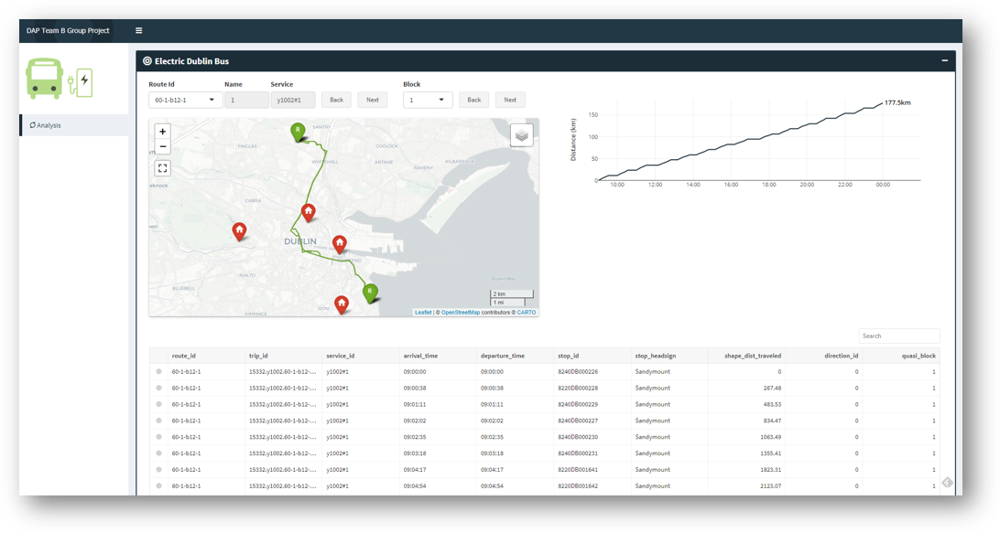

## dapTbElectricBus

Visualization of factors affecting the feasibility of transitioning the Dublin Bus network to electric buses.

**App** (under development)  
https://orb10x.shinyapps.io/dapTbElectricBus/
  

  
#### GTFS Ingestion & Processing Steps

1. Download & unzip GTFS data (web scrape from Transitfeeds site).
2. Save raw GTFS data to Azure SQL db.
3. Determine quasi-blocks (i.e, estimate of trips possible by the same bus on a route).
4. Define base case depot for each to bus to depart from & return to at end of block.
5. Identify dead trips & dead legs (bus trips necessary but not detailed in GTFS data).
6. Summarise block & trip info & save summary info to Azure SQL db.
7. Get route info from Azure Maps API using dead trip info.
8. Save raw route data from Azure Maps API to Azure Cosmos db.
9. Save log of post_ids for routes & applicable dead trips to Azure SQL db.
10. Extract raw route data from Azure Cosmos db & transform to table of total distance, total time & coords.
11. Get elevation data for all trips (GTFS & dead) from Open Elevation API.
11. Save transformed dead trip & elevation data to Azure SQL db.  
12. Visualize data in R Shiny.

  
#### GTFS General Notes

**stops** - stops where vehicles pick up or drop off passengers  
**routes** -  A route is a group of trips that are advertised to riders as a single service.. e.g. route 14A (note: not a separate file, referenced in trips.txt)  
**trips** - a single scheduled iteration of a route, in a certain direction at a certain time e.g. route 14A at 8AM weekdays, northbound  
**block** - a collection of trips undertaken by a single bus and driver before going back to the depot  
**stop_times** - times that a vehicle arrives at and departs from stops for each trip  
**calendar** - Service dates specified using a weekly schedule with start and end dates  
**shapes** - rules for mapping vehicle travel paths  

Blocks and trips in of themselves have no meaning in traveler facing capacity. Trips are vehicle trips, not passenger trips. A block is an ordered set of trips. Blocks historically are the basis for the paddles that operators pick up at "window dispatch" before they leave the yard to work the block on their shift. 

#### SME Notes

- Azure Maps for elevations, driving distance between two points & driving time between two points (if both are unknown).  
- For the first & last deadhead (from depot to first stop, and returning from last stop to depot) we get time and distance.
- For deadheads in-between trips, we already have time from GTFS so we just get distance.  
- We only get elevations for every "stop" and the depot
- We create weight over time and doors-open over time
- Also set the weight to zero for deadheads
- The shapes for journeys between stops are very detailed (every few metres)
- Toute between two stops isn't exactly the same every time
- Could for every point in the shapes or so some kind of spatial downsampling 

https://www.transportforireland.ie/transitData/PT_Data.html
